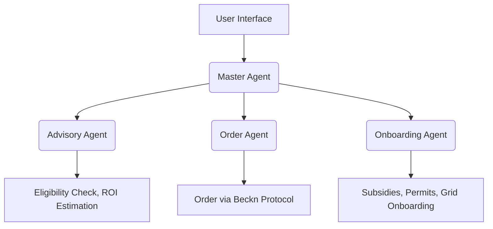

## 💡 Problem Statement : Utility-Led Agent for Rooftop Solar Adoption & DER Onboarding 
A utility needs users to adopt rooftop solar and participate in grid flexibility programs, while abstracting away the system's inherent complexity. The solution must guide households through eligibility, installation, subsidy application, and grid participation—**without the user having to manually coordinate with service providers**.


## 🧠 Solution: Multi-Agent Orchestrated AI System
We present a **modular, agent-based architecture** driven by a context-aware **Master Agent** that orchestrates a user’s complete solar journey using three specialized sub-agents:


## 🔍 Core Agents
- **🧭 Master Agent**: Receives all user inputs (chat), detects intent, routes to appropriate agents, and handles context-passing.
- **🎓 Advisory Agent**: Assesses eligibility based on location, energy consumption data, and recommends suitable solar configurations.
- **🛒 Order Agent**: Connects with solar vendors and service providers via **Beckn Protocol** to handle purchase and installation workflows.
- **🏛️ Onboarding Agent**: Applies for available subsidies. As well as adds the device to DEG.

Each agent is built to be modular, scalable, and easily extendable to support different utility contexts and geographies.


## 🛠️ Architecture Overview


### 🏗️ Solution Architecture
```mermaid

                    +---------------------+
                    |     Manager Agent   |
                    |---------------------|
                    | Receives all input  |
                    | Routes requests     |
                    | Transfers context   |
                    +---------------------+
                              |
        +---------------------+---------------------+
        |                     |                     |
+----------------+   +----------------+   +----------------+
| Advisory Agent |   |  Order Agent   |   |Onboarding Agent|
|----------------|   |----------------|   |----------------|
| Recommends     |   | Executes solar |   | Handles        |
| solar adoption |   | equipment and  |   | subsidies, and |
| options using  |   | service orders |   | device onboarding|
| local context  |   | (via Beckn)    |   | to the grid     |
+----------------+   +----------------+   +----------------+
```

## 🧭 End-to-End User Journey
- Explore Solar Options
The user chats with the system to check eligibility based on location and energy usage.

- Get Recommendations
The Advisory Agent provides tailored solar solutions and explains ROI and environmental benefits.

- Order Installation
The order agent, using Beckn protocol, connects to verified providers and facilitates a smooth transaction.

- Subsidies & Approvals
The Onboarding Agent takes over, applying for incentives, managing approvals, and reducing user effort to zero.

- Grid Onboarding 
Once installed, the device is added into Digital energy grid.


## 🛠️ Tech Stack
- **AI Agents**: Powered by LLM-based routing and orchestration
- **Beckn Protocol**: For decentralized service discovery and solar equipment ordering
- **Interoperability**: Designed to integrate with government APIs, DISCOMs, and subsidy platforms
- **Context Management**: Manager Agentmaintains and transfers user context across agents seamlessly


## 🏁 Key Features at a Glance
### Minimum Expected Capabilities
 **1. Guided, user-friendly interface**
 
  ✅ A familiar, chat-style interface walks users through each step.

 **2. Auto-apply subsidies, update costs, manage financing & approvals**   
  ✅ The Onboarding Agent files subsidy applications. The Manager Agent keeps every sub-agent in sync.
  
  **3. Agentic enrollment into incentive programs**    
  ✅ Upon successful completion of installation (i.e once the system is live), agent auto-enrolls the device in DER programs.The Onboarding Agent places request to register device to DEG and activate incentives.

### Good to have Capabilities
**1. Present users with transparent information, step-by-step guidance, and clear milestones throughout the process** 

  🔄 We’re training the Advisory Agent to provide clear, step-by-step status updates. Initial results are promising but still being refined.
 
### Bonus Considerations
Mechanisms for human-in-the-loop supervision and override.
  🔄  

## ⏳ What’s Next
- Voice & Public API support for hands-free and programmatic access
- AI-powered feasibility analysis using satellite imagery plus user-uploaded roof photos/videos
- Full web dashboard for an even friendlier user experience
- Integrate financing and loan options for purchase


## 🚧 Limitations & Constraints
While the solution showcases the full architecture and flow as per the problem statement, a few functionalities are simulated or abstracted due to current sandbox limitations or IP protection:
- Agentic Recommendations Not Fully Functional - The Order Agent uses the Beckn Protocol for product and service discovery. However, the World Engine does not contain vendor catalog items, so recommendations and dynamic ordering flows are simulated rather than fully functional.
- Permit Flow Auto-Approved - The Onboarding Agent is designed to handle permit workflows. Due to the absence of permit-issuing authorities/entities in the World Engine, all permit requests are auto-approved for the purpose of this demo.
- Proprietary Solar Potential Logic Masked - The solar potential estimation logic in the Advisory Agent is based on proprietary algorithms. For IP protection, this logic is masked in the shared repository, and representative results are shown in the demo.


## 🎥 Demo Video
**[Click to Watch the Demo](https://drive.google.com/drive/u/1/folders/1CBppfT84yFqQoTeTz3r0OXZAjV3lvRcB)**  
Get a walkthrough of how a house owner interacts with our AI system — from initial advice to purchase, installation and grid participation.
